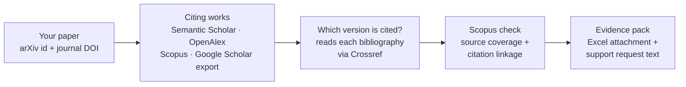

<h1 align="center">CiteReclaim</h1>

<p align="center">
  <b>Find the citations Scopus misses because authors cited your arXiv preprint<br>
  instead of the published paper, and get them linked back.</b>
</p>

<p align="center">
  <a href="https://github.com/GabrieleLozupone/CiteReclaim/actions/workflows/ci.yml"></a>
  
  <a href="LICENSE"></a>
  <a href="https://github.com/astral-sh/ruff"></a>
  
</p>

---

You posted a paper on arXiv, it was later published in a journal, and other authors keep
citing the arXiv version. Scopus treats the preprint and the journal article (the *Version of
Record*) as separate documents, so those citations often never reach the journal article and
its Scopus citation count stays lower than it should be. Google Scholar merges the two
versions, which is why the gap is easy to miss.

CiteReclaim finds these citations using free, public scholarly metadata, tells you which
ones are likely affected and why, and produces an evidence pack in the format Scopus support
asks for. You review it and send it yourself; whether Scopus applies the correction is up to
Scopus (see [Will Scopus accept the request?](#will-scopus-accept-the-request)).



### Quick start

```bash
pipx install git+https://github.com/GabrieleLozupone/CiteReclaim
citereclaim init
citereclaim scopus-sources update
citereclaim paper add --name LDAE --arxiv 2504.08635 --doi 10.1016/j.media.2026.103932
citereclaim sync LDAE
citereclaim report LDAE
citereclaim export-support LDAE      # → output/LDAE/scopus_reference_linking.xlsx
```

No API key is required. Adding a free OpenAlex key and your email for Crossref makes runs
faster, and a Scopus API key (usually from your institution's network) turns "likely" into
verified results. See [API keys](#5-optional-api-keys).

## Contents

1. [What the tool does](#1-what-the-tool-does)
2. [What the tool DOES NOT do](#2-what-the-tool-does-not-do)
3. [Free services used](#3-free-services-used)
4. [Required API keys](#4-required-api-keys)
5. [Optional API keys](#5-optional-api-keys)
6. [How to obtain each API key](#6-how-to-obtain-each-api-key)
7. [Scopus limitations](#7-scopus-limitations)
8. [Google Scholar limitations](#8-google-scholar-limitations)
9. [Installation](#9-installation)
10. [Configuration](#10-configuration)
11. [Quick start](#11-quick-start)
12. [Adding a paper](#12-adding-a-paper)
13. [Importing Google Scholar results](#13-importing-google-scholar-results)
14. [Updating the Scopus Source List](#14-updating-the-scopus-source-list)
15. [Running a reconciliation](#15-running-a-reconciliation)
16. [Reading the report](#16-reading-the-report)
17. [Exporting evidence for Scopus support](#17-exporting-evidence-for-scopus-support)
18. [Running periodically](#18-running-periodically)
19. [Data privacy](#19-data-privacy)
20. [Troubleshooting](#20-troubleshooting)
21. [Architecture](#21-architecture)
22. [Testing](#22-testing)
23. [License](#23-license)

---

## 1. What the tool does

For each paper you track (arXiv id and/or final journal DOI), CiteReclaim:

1. **Resolves both versions.** It finds the preprint and the Version of Record in Crossref,
   Semantic Scholar and OpenAlex. These indexes sometimes merge the two versions into one
   record and sometimes keep them separate; both cases are handled.
2. **Discovers citing works** from two independent citation graphs (Semantic Scholar and
   OpenAlex). It adds the Scopus API's cited-by list if you have a key, plus any Google Scholar
   export you import.
3. **Normalises and deduplicates** citing works into canonical records. It prefers the DOI,
   then PMID, arXiv id, provider ids, and finally a *conservative* fuzzy title + author + year
   match. Ambiguous cases are **never merged automatically**; they are flagged for manual
   review.
4. **Classifies each citing work** as journal article, conference paper, preprint,
   thesis/dissertation, book, book chapter or unknown.
5. **Determines which version is cited** (`PREPRINT`, `VERSION_OF_RECORD`, `BOTH`,
   `UNKNOWN`). It reads the citing work's actual bibliography entry (from Crossref deposited
   references) and records the evidence, for example:

   ```json
   {
     "target_version": "PREPRINT",
     "evidence": [
       "matched reference via reference DOI 10.48550/arxiv.2504.08635",
       "reference DOI is the arXiv DOI 10.48550/arxiv.2504.08635",
       "reference does not contain the final DOI"
     ]
   }
   ```

   It also spots a subtle case: the reference text says "arXiv" but Crossref's reference
   matcher attached the journal DOI (`doi-asserted-by: crossref`). The author cited the
   preprint even though the metadata shows the final DOI.
6. **Checks Scopus source coverage** against Elsevier's free *Scopus Source Title List*,
   by ISSN/eISSN first, then ISBN (proceedings), and only then by exact normalised title.
   Coverage years and discontinued titles are honoured.
7. **Optionally verifies article-level indexing and citation linkage** with the Scopus API if
   you have a key. It confirms the citing article exists in Scopus and checks whether Scopus
   already lists it among the documents citing the Version of Record.
8. **Recommends an action** for every citing work (`OK`, `CHECK_SCOPUS`,
   `LIKELY_MISSING_LINK`, `NON_SCOPUS`, `PREPRINT_ONLY`, `UNKNOWN`). Each action comes with an
   **explainable confidence score** that lists every contributing signal.
9. **Produces reports** in the terminal and as CSV/JSON. It also produces a Scopus-support
   pack: an **Excel attachment in the format Scopus support asks for**
   (`output/<NAME>/scopus_reference_linking.xlsx`), plus the ready-to-paste request text.

## 2. What the tool DOES NOT do

- It does **not** scrape Google Scholar, or any other website that forbids it.
- It does **not** bypass CAPTCHAs, robots.txt, authentication, paywalls or rate limits.
- It does **not** use any paid API or scraping service (no SerpAPI, BrightData, ScraperAPI,
  Apify, Oxylabs, ...).
- It does **not** submit anything to Elsevier. The support export is a file for *you* to
  review and send.
- It does **not** guarantee that Scopus will make the correction. See
  [Will Scopus accept the request?](#will-scopus-accept-the-request)
- It does **not** claim that a citation is definitively missing from Scopus unless the Scopus
  API shows the citing article indexed **and** absent from the Version of Record's citers.
- It does **not** treat "journal is in the Scopus Source List" as proof that an article is
  indexed.
- It does **not** use machine learning; all scoring is deterministic and explainable.

## 3. Free services used

Policies below were checked against the official documentation on **2026-09-29**. APIs change,
so re-check the linked pages if something stops working.

| Service | Required? | Cost | Key needed? | Purpose |
|---------|-----------|------|-------------|---------|
| [Crossref REST API](https://www.crossref.org/documentation/retrieve-metadata/rest-api/) | Yes | Free | No (email recommended for the polite pool) | DOI metadata, ISSN/ISBN, types, **deposited reference lists** (main signal for which version is cited), title→DOI resolution |
| [Semantic Scholar Academic Graph API](https://www.semanticscholar.org/product/api) | Yes | Free | Optional | Citation graph, external ids, venues, publication types |
| [OpenAlex](https://help.openalex.org/) | Yes (best effort) | Free daily allowance; usage-based beyond it | Optional but **strongly recommended** (free) | Independent second citation graph, sources/ISSN, work types |
| [Scopus Source Title List](https://www.elsevier.com/products/scopus/content) | Yes | Free | No | Journal/proceedings coverage |
| [Scopus APIs](https://dev.elsevier.com/) | No | Free for eligible non-commercial academic use, subject to Elsevier entitlement | Yes | Exact article-level verification and cited-by comparison |
| Google Scholar | No direct API integration | — | — | Manual import only |

Current policies in detail:

- **Crossref**: no signup. The *public pool* allows about 5 requests per interval with
  concurrency 1. The *polite pool* (your email in the `mailto` parameter or User-Agent)
  allows about 10 requests with concurrency 3. HTTP 429 means you are rate-limited; 403
  means you have been blocked manually. The tool sends `mailto` when `CROSSREF_MAILTO` is set,
  identifies itself in the User-Agent, and waits 0.12 s (polite) or 0.25 s (public) between
  requests.
- **Semantic Scholar**: most endpoints are public without authentication. Anonymous traffic
  shares a pool across *all* anonymous users and is throttled during busy periods; 429 errors
  are common in practice. Keys (introductory rate: 1 request/second) are optional. The tool
  waits ≥ 1.1 s between requests and backs off exponentially on 429.
- **OpenAlex (changed in February 2026)**: OpenAlex now uses usage-based pricing. A
  **free API key** gives about **$1 of usage per day**, reset at midnight UTC. Without a key
  you can still query, but only with **$0.10/day**, which is intended for testing. Singleton
  lookups by ID/DOI are free; list/filter queries cost $0.10 per 1,000 calls; full-text search
  costs $1 per 1,000 calls. The key goes in the `api_key` query parameter. The tool prefers
  free singleton lookups and uses filter calls only for `cites:` lists. It reports the
  accumulated `meta.cost_usd` in the sync stats. **This differs from older OpenAlex
  documentation**, which described OpenAlex as key-free with an email-based "polite pool". The
  tool still sends `OPENALEX_MAILTO` (harmless), but the key is what matters now.
- **Scopus APIs**: "available for no charge, for non-commercial use, subject to Elsevier's
  policies and limits". Default quotas: Scopus Search 20,000 requests/week at 9 requests/second;
  Abstract Retrieval 10,000/week. The *Citation Overview* API is access-controlled and needs
  separate approval. This tool uses only the Scopus Search API.
- **Scopus Source Title List**: a free monthly `.xlsx` published on the Scopus content page.
  It includes discontinued titles and conference proceedings. The file URL changes with every
  release, so the tool discovers it from the page.

## 4. Required API keys

**None.** The tool works with **zero API keys**:

- Crossref needs no signup at all.
- Semantic Scholar works anonymously (slower, occasionally throttled).
- OpenAlex works without a key within its small daily test budget. That is enough for a few
  papers with modest citation counts, but get the free key for regular use.
- The Scopus Source Title List is a public download.
- The Scopus API is entirely optional; without it, reports show source-level coverage only.

## 5. Optional API keys

| Variable | Effect |
|----------|--------|
| `CROSSREF_MAILTO` | Your email; puts requests in Crossref's faster *polite pool*. **Strongly recommended.** |
| `SEMANTIC_SCHOLAR_API_KEY` | Dedicated rate limit instead of the shared anonymous pool. Optional. |
| `OPENALEX_API_KEY` | Raises the OpenAlex daily budget 10× (free). Strongly recommended. |
| `OPENALEX_MAILTO` | Contact email sent to OpenAlex. Optional. |
| `ELSEVIER_API_KEY` | Enables article-level Scopus verification and cited-by comparison. |
| `ELSEVIER_INSTTOKEN` | Institutional token; needed when you are off your institution's network. |

## 6. How to obtain each API key

- **Crossref**: nothing to obtain. Just set `CROSSREF_MAILTO=you@university.edu`.
- **Semantic Scholar**: fill in the form at
  <https://www.semanticscholar.org/product/api#api-key-form>. The key arrives by email; do not
  share it.
- **OpenAlex**: create a free account at <https://openalex.org>, then copy your key from
  <https://openalex.org/settings/api>.
- **Elsevier / Scopus**: sign in at <https://dev.elsevier.com/> with an Elsevier account and
  choose *"I want an API key"*. Accept the terms for non-commercial use. Keys work from inside
  your institution's IP range when the institution subscribes to Scopus. For off-campus
  use, ask Elsevier (via the developer portal's support) or your library for an
  **institutional token** (`ELSEVIER_INSTTOKEN`). Some capabilities, such as the Citation
  Overview API, need separate approval from Elsevier.

## 7. Scopus limitations

- **Source covered ≠ article indexed.** A match against the Scopus Source List means only that
  Scopus covers the *journal/source* for that year. It does **not** mean this exact article
  is indexed; Scopus occasionally misses articles or indexes them late. Such rows are
  shown as `source` / `SCOPUS_SOURCE_ONLY`.
- **Only a successful Scopus article lookup proves article-level indexing**
  (`SCOPUS_CONFIRMED`). That requires `ELSEVIER_API_KEY` and an entitlement that allows
  Scopus Search from your network or insttoken.
- **Permission problems are not "not indexed".** HTTP 401/403 map to
  `SCOPUS_PERMISSION_DENIED`, and quota or network problems map to
  `SCOPUS_API_UNAVAILABLE`. They never become `SCOPUS_NOT_FOUND`. After the first 401/403 the
  tool stops querying Scopus for the rest of the run instead of retrying.
- **Cited-by comparison.** With a key, the tool runs a Scopus Search `REFEID(<EID of the
  Version of Record>)` query. It lists documents whose Scopus reference list is linked to the
  journal article. If a citing article is confirmed in Scopus but absent from that list, the
  row becomes `LIKELY_MISSING_LINK`. `REFEID` is a standard Scopus advanced-search field, but
  it is not described on the dev portal's search-tips page. If your entitlement rejects it,
  linkage stays `UNVERIFIED` and the action stays `CHECK_SCOPUS`.
- **Per-article proof from Scopus reference lists (institutional network/VPN).** For each
  citing article confirmed in Scopus, the tool reads its bibliography as Scopus sees it
  (Abstract Retrieval `view=REF`). It then checks which Scopus record the reference to your
  paper is attached to. If that is the Version of Record's EID, the row is `OK`. If it is
  another record, typically a separate record Scopus created for the arXiv preprint (type
  `originalReference/other`), the row is `LIKELY_MISSING_LINK`. The wrong EID goes into the
  Excel file and the request text, which asks Scopus to link those references to the
  published article. This view usually needs institutional entitlement: run from
  your university network/VPN. `citereclaim doctor` shows which Scopus features your
  key and network allow. Articles the Scopus API confirms are **not** indexed are left out of
  the support pack.
- **Cited-by count check (works with a basic key).** Many keys may not use `REFEID`
  (Scopus answers *"not allowed for this requestor"*) but can read the Version of Record's
  `citedby-count`. The tool compares that count with the number of citing articles it
  confirmed in Scopus. If Scopus counts fewer, then **at least the difference** are not linked
  to the Version of Record (pigeonhole). That appears in the report, the evidence pack and the
  support request text. Rows become `LIKELY_MISSING_LINK` only when the count is fully
  explained by articles that cite the final DOI explicitly; otherwise they stay
  `CHECK_SCOPUS`. As Elsevier requires, displayed counts link to the Scopus cited-by list
  ("Cited N times in Scopus").
- **Conference proceedings** often have no ISSN. The tool matches ISBNs against the list's
  *All Conf. Proceedings* sheet. When neither ISSN nor ISBN is available, it matches on the
  conference acronym plus a similar series name. If the **same edition** is listed, the result
  is `COVERED_TITLE_MATCH`; if only **earlier editions** are listed, it is
  `SERIES_PREVIOUSLY_INDEXED` (a heuristic, always resolved as `CHECK_SCOPUS`, never `OK`).
- The Source List lags indexing by weeks. For an **active** source, a year just after the
  last listed coverage year is treated as covered, and the evidence says "list lag likely".

## 8. Google Scholar limitations

- Google Scholar has no public API, and its terms forbid automated scraping, so this tool
  **never contacts Google Scholar**.
- You can export or copy the "Cited by" list yourself and import it. Options include a
  reference manager, *Publish or Perish* (CSV export), or Scholar's own "Cite → BibTeX" links.
  A hand-made CSV works too.
- Scholar exports rarely include DOIs. Each row is resolved through Crossref
  (bibliographic query), then Semantic Scholar (title match), then OpenAlex (title search),
  with strict thresholds. Unresolved rows are kept, marked `unresolved`, and merged by
  title only when the match is unambiguous.
- Scholar-derived rows carry `google_scholar_import` in *Found in*. **A Scholar import is
  never treated as a Scopus result.**

## 9. Installation

Requires **Python 3.12+**.

To use the command-line tool only:

```bash
pipx install git+https://github.com/GabrieleLozupone/CiteReclaim
# or: uv tool install git+https://github.com/GabrieleLozupone/CiteReclaim
```

To work from a clone (needed for `run.sh`, the example files and the macOS reminder):

```bash
git clone https://github.com/GabrieleLozupone/CiteReclaim.git
cd CiteReclaim
python3.12 -m venv .venv && source .venv/bin/activate
pip install -e .            # or: pip install -e ".[dev]" for tests/linting
citereclaim --help
```

With [uv](https://github.com/astral-sh/uv):

```bash
uv venv -p 3.12 && uv pip install -e ".[dev]"
```

Dependencies: `httpx`, `pydantic`, `typer`, `rich`, `rapidfuzz`, `openpyxl` (reads the
Scopus list), and `pyyaml` (example paper file). The database is the standard-library `sqlite3`.

## 10. Configuration

Configuration comes from environment variables or a `.env` file in the current directory.
Real environment variables take precedence over `.env`. Copy the template:

```bash
cp .env.example .env
$EDITOR .env
```

```ini
CROSSREF_MAILTO=
SEMANTIC_SCHOLAR_API_KEY=
OPENALEX_API_KEY=
OPENALEX_MAILTO=
ELSEVIER_API_KEY=
ELSEVIER_INSTTOKEN=
```

All values are optional. `.env` is in `.gitignore`, so **never commit keys**.

Data lives in `~/.citereclaim/` by default: the SQLite database, the HTTP cache and
the downloaded source list. Override it with `CITERECLAIM_HOME=/path` or
`citereclaim --home /path ...`.

Cache lifetimes: DOI/work metadata 30 days, citation lists 7 days, title searches 30 days,
Scopus API 7 days, Scopus Source List 30 days, and "not found" answers 1 day. Use
`sync --refresh` to bypass the cache, `sync --offline` to use only the cache, and
`cache stats` / `cache clear` to inspect it.

`citereclaim doctor` shows what is configured and tests connectivity to every
provider.

## 11. Quick start

```bash
citereclaim init
citereclaim scopus-sources update           # ~25 MB download, once a month
citereclaim paper add --name LDAE --arxiv 2504.08635 --doi 10.1016/j.media.2026.103932
citereclaim sync LDAE
citereclaim report LDAE
citereclaim export-support LDAE             # evidence pack in output/LDAE/
```

Both example papers can be loaded at once:

```bash
citereclaim paper import examples/papers.yaml
citereclaim sync --all
citereclaim report --all
```

**One command for everything.** `run.sh` creates the virtualenv if needed, then runs init,
the Source List update, paper import, Google Scholar import (see
[section 13](#13-importing-google-scholar-results)), sync, report and all exports:

```bash
cp examples/papers.yaml my_papers.yaml   # replace the example papers with yours
./run.sh my_papers.yaml                  # REFRESH=1 bypasses the cache, DETAILS=1 adds evidence
```

## 12. Adding a paper

```bash
citereclaim paper add \
  --name AXIAL \
  --arxiv 2407.02418 \
  --doi 10.1186/s12911-026-03833-2
```

- `--arxiv` accepts `2407.02418`, `arXiv:2407.02418v2`, an arxiv.org URL, or the arXiv DOI.
  The preprint DOI defaults to `10.48550/arXiv.<id>`; override it with `--arxiv-doi` for other
  preprint servers.
- `--doi` is the final (journal) DOI. Any form works (`https://doi.org/...`, `doi:...`).
- Only one identifier is required. If you give only the arXiv id, the tool tries to infer the
  journal DOI from Semantic Scholar or Crossref relations and prints a warning asking you to
  confirm it.
- `--title` and `--authors "A. One; B. Two"` are optional; they are fetched from Crossref and
  Semantic Scholar when missing.
- Running `paper add` again with the same `--name` updates the paper.
- Other commands: `paper list [--json]`, `paper remove NAME`, and
  `paper import examples/papers.yaml`.

## 13. Importing Google Scholar results

1. Open your paper's "Cited by N" page in Google Scholar **in your browser**.
2. Export the entries with a reference manager or Publish or Perish, or copy them into a
   spreadsheet.
3. Import the file:

```bash
citereclaim scholar import cited_by.csv  --paper LDAE
citereclaim scholar import cited_by.bib  --paper LDAE
citereclaim scholar import cited_by.json --paper LDAE
```

`--paper` can be omitted when only one paper is tracked. The import triggers a sync of that
paper, which resolves and merges the rows; `--no-sync` defers that to the next `sync`.
Re-importing the same rows does nothing, because rows are de-duplicated by content hash.

Accepted CSV columns (case-insensitive, extra columns ignored; `,`, `;` or tab separated):

| Field | Accepted headers |
|-------|------------------|
| title | `title`, `article title`, `paper title`, `document title` |
| authors | `authors`, `author`, `author(s)` |
| year | `year`, `publication year`, `date`, `published` |
| journal | `journal`, `venue`, `source`, `publication`, `source title`, `booktitle`, `conference` |
| doi | `doi` (a DOI inside `url` is also detected) |
| url | `url`, `link`, `articleurl` |

JSON may be a list of objects or `{"citations": [...]}`. CSL-JSON is understood (`author`,
`issued`, `container-title`, `DOI`). BibTeX supports `@article`, `@inproceedings`, `@misc`
and similar entry types; `booktitle`, `school` and `howpublished` count as the venue.

**With `run.sh`** there is no manual step. Save each export as
`scholar_exports/<NAME>.bib` (or `.csv` / `.json`), where `<NAME>` is the paper's `--name`
(e.g. `scholar_exports/LDAE.bib`). `./run.sh` imports it before syncing. Rows already imported
are skipped, so you can just overwrite the file with a newer export and run again.

## 14. Updating the Scopus Source List

```bash
citereclaim scopus-sources update           # skips if < 30 days old
citereclaim scopus-sources update --force
citereclaim scopus-sources status
citereclaim scopus-sources lookup 1361-8415 # or an exact journal title
```

`update` fetches <https://www.elsevier.com/products/scopus/content> after checking
`robots.txt`. It finds the "Source title list" asset link: first from the page's embedded
asset metadata, then from anchor labels, then from the historical `ext_list_<Mon>_<YYYY>.xlsx`
name pattern. It then downloads the file and records the URL, date, version label
(e.g. "Aug 2026") and SHA-256.

If automatic discovery ever breaks (Elsevier redesigns the page), download the file manually
from the same page and import it:

```bash
citereclaim scopus-sources import ~/Downloads/ext_list_Aug_2026.xlsx
```

`.xlsx` and `.csv` are accepted. The parser detects header rows and columns by name, not
position. It reads the main source sheet (title, ISSN, eISSN, coverage, active/inactive,
discontinued flag, source type, publisher), the *Discontinued Titles* sheet, the *Serial
Conference Proceedings* sheet and the *All Conference Proceedings* ISBN sheet. *Accepted
Titles* (accepted but not yet indexed) are deliberately **not** treated as coverage.

## 15. Running a reconciliation

```bash
citereclaim sync LDAE
citereclaim sync --all
citereclaim sync --all --quiet      # for cron
citereclaim sync LDAE --json        # machine-readable run stats
citereclaim sync LDAE --refresh     # ignore the HTTP cache
```

A sync:

1. resolves both versions and stores each provider's record ids;
2. pulls citations from Semantic Scholar and OpenAlex (and Scopus `REFEID` with a key), plus
   stored Scholar imports;
3. clusters the records into unique citing works and resolves missing DOIs through Crossref;
4. enriches each work through Crossref, fetching metadata and the reference list;
5. classifies the cited version, matches the Scopus Source List and optionally queries Scopus;
6. stores the results and evidence in SQLite.

If one provider is down or rate-limited, the sync **continues** with the others, marks the
run `partial`, and **keeps** citations found by earlier runs instead of deleting them. A
second run within the cache TTL makes almost no network requests.

## 16. Reading the report

```bash
citereclaim report LDAE
citereclaim report LDAE --details   # full evidence for every citation
citereclaim report --all --json
```

Example (abridged, real data, no API keys):

```text
╭─ LDAE ────────────────────────────────────────────────────────────────────────────────────╮
│ Citing paper                               Year  Venue           Target Scopus Action       Conf │
│ POWDR: Pathology-Preserving Outpainting…   2026  Diagnostics     arXiv  source CHECK_SCOPUS 0.75 │
│ Effect of the Kullback-Leibler Prior…      2027  Lecture Notes…  arXiv  source CHECK_SCOPUS 0.65 │
│ Shape modeling of longitudinal medical…    2025  Frontiers in…   arXiv  source CHECK_SCOPUS 0.65 │
│ Generative latent representations of…      2026  Pattern Anal…   final  source OK           0.70 │
│ Anatomically Guided Latent Diffusion…      2026  ArXiv           ?      no     PREPRINT_ONLY 0.28 │
╰───────────────────────────────────────────────────────────────────────────────────────────╯
╭─ Summary ─────────────────────────────╮
│ Discovered citations: 11              │
│ Unique citing works: 8                │
│ Confirmed Scopus articles: 0          │
│ Scopus-covered source only: 5         │
│ Not Scopus: 0                         │
│ Likely citing preprint: 3             │
│ Likely citing Version of Record: 3    │
│ Needs manual review: 2                │
╰───────────────────────────────────────╯
```

Columns:

- **Target**: which version the bibliography entry cites (`arXiv`, `final`, `both`, `?`).
- **Scopus**: `yes` = article confirmed through the Scopus API; `source` = the journal is in
  the Source List (article not verified); `source*` = matched by title only; `series?` =
  earlier editions of the conference are indexed; `no` = not covered; `not found` = the Scopus
  API did not find the article; `?` = unknown.
- **Action**:

| Action | Meaning |
|--------|---------|
| `OK` | Nothing to do. Scopus already links the citation to the Version of Record, or the reference explicitly cites the final DOI (publisher-asserted) in a Scopus-covered source. |
| `CHECK_SCOPUS` | Likely in Scopus, but linkage to the final version is unverified. Check the article's references in Scopus. |
| `LIKELY_MISSING_LINK` | Confirmed in Scopus by the API **and** absent from the Version of Record's Scopus citers. |
| `NON_SCOPUS` | Source not covered by Scopus (or not for that year), article not found, or a thesis. |
| `PREPRINT_ONLY` | The citing work itself is only a preprint (Scopus normally does not count these). |
| `UNKNOWN` | Coverage could not be determined (no ISSN/ISBN/matching venue). Manual check. |

- **Conf**: deterministic confidence (0–1) in the recommendation. `--details` shows each
  contributing signal. Positive signals: exact DOI, found in several sources, an explicit
  arXiv reference, an explicit final DOI, an ISSN match, Scopus confirmation, verified
  linkage. Penalties: fuzzy-title-only identity, year mismatch, conflicting ids, ambiguous
  duplicates, unknown target version, unmatched source.
- **⚑** marks rows that need manual review (possible duplicates, fuzzy-only identity,
  conflicts, unknown coverage).

Deviation from a simpler rule set: a Scopus-covered citing article whose bibliography cites
the **final DOI explicitly** (publisher-asserted, or the DOI appears in the reference text) is
marked `OK` even without the Scopus API, because it does not need reconciliation. If the final
DOI was only attached by Crossref's automatic matcher, the row stays `CHECK_SCOPUS`.

## 17. Exporting evidence for Scopus support

```bash
citereclaim export-support LDAE
citereclaim export-support LDAE --cited-scopus-link "https://www.scopus.com/record/display.uri?eid=2-s2.0-..."
```

It writes four files to `output/LDAE/`:

| File | Use |
|------|-----|
| `scopus_reference_linking.xlsx` | **Attachment for the Scopus support form.** Scopus asks for large numbers of corrections as an Excel or Word attachment. |
| `scopus_support_request.txt` | Ready-to-paste *Subject* and *Your question* text, in two versions: A for large numbers of corrections (cited article in the form's format, citing articles in the attachment); B, recommended for a few corrections, with every record pasted in the form's format (the Excel file can be attached as well). |
| `scopus_missing_citations.csv` | Full internal data: statuses, confidence, all evidence. |
| `scopus_missing_citations.md` | Human-readable evidence report for your own review. |

The Excel sheet uses the columns Scopus support needs:

| Cited article title | Cited article link in Scopus | Citing article | Citing article link in Scopus | Final DOI | Preprint / arXiv | Reference / evidence | Requested correction |
|---|---|---|---|---|---|---|---|

The first four columns are the fields of the Scopus support form, word for word and in the
same order; the other four support the request.

*Reference / evidence* follows one fixed pattern, e.g. `Reference cites arXiv:2504.08635 and
is currently linked in Scopus to record 2-s2.0-105021592137 instead of published record
2-s2.0-105027319428.`, followed by the original reference in quotes when available.
*Requested correction* names the target record explicitly (`Link this reference to Scopus
record 2-s2.0-105027319428 (published Version of Record).`). Confidence scores, coverage
checks and other internal evidence are kept out of the sheet; they are in the CSV and
Markdown reports.

Scopus links in the sheet are plain text, not clickable hyperlinks. When a link is clicked in
Excel, Excel first fetches it itself without your browser's Scopus session. Scopus then
answers with a one-time Elsevier login redirect, and Excel opens that redirect instead of the
record. Copy a link into the browser to open it.

**Scopus record links.** Scopus support asks for links to Scopus records, not only DOIs.
- **With `ELSEVIER_API_KEY`**, the tool stores the record URL of every citing article it
  confirms in Scopus, and of the published (cited) article. The Excel file is then complete.
- **Without a key**, these cells stay empty. Fill them from Scopus: open the DOI-search
  helper link, copy the record URL, and pass the published article's URL with
  `--cited-scopus-link`. The command reports how many links are still missing.

Which rows are included: every `LIKELY_MISSING_LINK` (proven by Scopus, whichever version
the author cited), plus every `CHECK_SCOPUS` citation whose reference cites the **preprint**
(`PREPRINT` or `BOTH`). Articles the Scopus API reports as not indexed are left out. Rows marked
`CHECK_SCOPUS` are not yet verified at article level; check each one in Scopus first.

**Citations the open indexes miss.** Some publishers deposit almost empty references (for
example only `{"author": "Lozupone"}`). Neither citation graph can link such a work, and no
tool can tell which version it cites. If you see the citation in Scopus, add it by hand:

```bash
citereclaim citation add --paper LDAE --doi 10.1016/j.neucom.2025.132111 \
    --cites preprint --note "reference verified in Scopus"
citereclaim citation list --paper LDAE
citereclaim citation remove --paper LDAE --doi 10.1016/j.neucom.2025.132111
```

The work is enriched from Crossref like any other citation. Its cited version is taken from
your confirmation, shown in the evidence as "verified by the author", and it appears in the
Excel file.

**Nothing is sent anywhere.** You review the files and submit them through the Scopus support
form yourself.

### Will Scopus accept the request?

**There is no guarantee.** Scopus decides case by case, and this tool cannot predict the
outcome.

What supports the request:

- Scopus has an official channel for exactly this: the support form's *Citation
  Corrections* reason, for citations that are missing because documents "are incorrectly
  linked" ([Scopus Support](https://www.elsevier.support/scopus/answer/how-can-i-add-missing-citations)).
- Corrections require both the citing and the cited article to be in Scopus. The support
  pack includes only citing articles that the Scopus API confirms as indexed, and the cited
  article is your published Version of Record.
- The request asks only to link references to the published article. It does not ask Scopus
  to merge records.

What may lead Scopus to decline:

- Scopus states that "neither citations to-and-from the preprints, nor links with the final
  version of the article are captured", and that linking preprints to published versions
  "is being evaluated"
  ([Scopus Support](https://www.elsevier.support/scopus/answer/what-are-preprints)).
  Support staff may therefore answer that the reference cites a different document (the
  preprint) and keep it linked as written.

Processing usually takes a few weeks. Run the tool again afterwards: citations that Scopus has
linked become `OK` and drop out of the support pack. If a citation you reported is still
listed, reply to your existing ticket rather than opening a new one.

General exports:

```bash
citereclaim export --format csv  --output report.csv
citereclaim export --format json --output report.json --paper AXIAL
```

## 18. Running periodically

`sync --all` is idempotent and cache-aware. Citation lists refresh after 7 days, so a weekly
run is a good fit.

**cron** (Monday 06:00):

```cron
0 6 * * 1  cd /home/me/citereclaim && .venv/bin/citereclaim scopus-sources update >/dev/null; .venv/bin/citereclaim sync --all --quiet && .venv/bin/citereclaim export --format csv --output /home/me/citations/report.csv
```

`scopus-sources update` does nothing until the local list is 30 days old, so it is safe to run
every week. Run the command from the directory that holds your `.env`, or export the
variables in the crontab.

**systemd timer**:

```ini
# ~/.config/systemd/user/citereclaim.service
[Unit]
Description=CiteReclaim weekly sync

[Service]
Type=oneshot
WorkingDirectory=%h/citereclaim
EnvironmentFile=%h/citereclaim/.env
ExecStart=%h/citereclaim/.venv/bin/citereclaim sync --all --quiet
ExecStartPost=%h/citereclaim/.venv/bin/citereclaim scopus-sources update

# ~/.config/systemd/user/citereclaim.timer
[Unit]
Description=Run CiteReclaim weekly

[Timer]
OnCalendar=Mon *-*-* 06:00:00
Persistent=true

[Install]
WantedBy=timers.target
```

```bash
systemctl --user daemon-reload && systemctl --user enable --now citereclaim.timer
```

**GitHub Actions** (optional; store keys as repository secrets). Scopus API keys are usually
bound to institutional IP ranges, so Scopus checks typically **will not** work from GitHub's
runners unless you have an insttoken. Everything else works. Persist the data directory as an
artifact or cache between runs. A ready-to-copy workflow is in
[`examples/github-actions-weekly.yml`](examples/github-actions-weekly.yml).

No cloud deployment is needed; a laptop cron job is enough.

**macOS monthly reminder.** Google Scholar has no API, so its exports cannot be automated.
Instead, `scripts/install_reminder.sh` installs a LaunchAgent that shows a dialog on day 1 of
every month at 10:00 with the steps to follow (export from Scholar, run `./run.sh`, send the
files to Scopus support). The **Start** button opens Google Scholar, the `scholar_exports/`
folder and a terminal in the project.

```bash
./scripts/install_reminder.sh                        # install or update
./scripts/install_reminder.sh --test                 # show the reminder now
./scripts/install_reminder.sh --uninstall            # remove it
DAY=15 HOUR=9 BROWSER_APP="Google Chrome" TERMINAL_APP=iTerm ./scripts/install_reminder.sh
```

Citations that Scopus has linked in the meantime become `OK` and drop out of the support
files, so each monthly run lists only what is still missing. A citation you have already
reported may appear again until Scopus processes the request; keep a dated copy of each
submitted `output/<NAME>/` folder to tell old requests from new ones.

## 19. Data privacy

- Everything is stored **locally** in the SQLite database in your data directory: tracked
  papers, citing-work metadata, reference lists, the HTTP cache (gzip-compressed raw
  responses, useful for reproducible debugging) and sync logs.
- Outgoing requests contain only public identifiers (DOIs, arXiv ids, titles) sent to
  Crossref, Semantic Scholar, OpenAlex and, if configured, Elsevier. Your contact email is sent
  only if you configure `CROSSREF_MAILTO` / `OPENALEX_MAILTO`; it goes in the `mailto`
  parameter and User-Agent, as those services request.
- API keys are read from the environment or `.env` and are **excluded from cache keys**. They
  are never written to reports. `.env` is git-ignored.
- Nothing is uploaded or submitted on your behalf.

## 20. Troubleshooting

| Symptom | Cause / fix |
|---------|-------------|
| `semantic scholar ... RateLimited: HTTP 429` | Anonymous S2 traffic shares one pool. The tool backs off and continues; the run is `partial` and earlier results are kept. Re-run later or set `SEMANTIC_SCHOLAR_API_KEY`. |
| OpenAlex 429 / budget exhausted | No-key budget is $0.10/day. Set a free `OPENALEX_API_KEY`. |
| `Scopus Source List not loaded` | Run `citereclaim scopus-sources update` (or `import FILE`). |
| `Automatic update failed` | Elsevier changed the page. Download the "Source title list" `.xlsx` manually and run `scopus-sources import FILE`. |
| `SCOPUS_PERMISSION_DENIED` | The key is invalid, or you are off-campus without `ELSEVIER_INSTTOKEN`. Check with `citereclaim doctor`. |
| Many `UNKNOWN` actions | Usually conference papers without ISSN/ISBN. Look them up in Scopus manually. |
| Target `?` (UNKNOWN) | The citing publisher did not deposit references with Crossref. The version cannot be determined from open data; check the PDF. |
| A duplicate appears twice with ⚑ | Deliberately not auto-merged (conflicting DOIs or insufficient evidence). Check with `report --details`. |
| Need a completely fresh fetch | `citereclaim sync NAME --refresh` or `cache clear`. |
| Verbose HTTP logs | `citereclaim -v sync NAME` |

## 21. Architecture

Background research on each external service (rate limits, auth, quirks) is in
[docs/design-notes.md](docs/design-notes.md).

```text
citereclaim/
  cli.py              Typer commands, Rich output
  config.py           env/.env settings, TTLs, User-Agent
  db.py               SQLite schema + repository (papers, paper_versions, works, citations,
                      citation_sources, references, venues, scopus_sources, api_cache,
                      sync_runs, manual_reviews, scholar_imports)
  models.py           pydantic models and status enums
  matching.py         DOI/arXiv/ISSN/ISBN/title normalisation, fuzzy matching, EntityResolver
  reconciliation.py   cited-version classifier, action rules, confidence model
  pipeline.py         Syncer: resolve versions → discover → dedupe → enrich → reconcile → store
  reporting.py        terminal report, CSV/JSON export, Scopus-support pack
  providers/
    base.py           HttpClient: SQLite cache, per-provider rate limiter with jitter,
                      exponential backoff, Retry-After, typed errors, no retries on 401/403
    crossref.py       works, bibliographic search, deposited references
    semantic_scholar.py  paper lookup (DOI/ARXIV), citations with contexts, title match
    openalex.py       work lookup, cites: filter with cursor paging, title search, cost tracking
    scopus.py         optional Scopus Search: DOI() lookups, REFEID() cited-by
    scopus_sources.py Source Title List discovery/download/parse/index/match
    scholar_import.py CSV / BibTeX / JSON parsers
```

Design choices:

- **Identifier priority** for deduplication: DOI → PMID → arXiv → Semantic Scholar/OpenAlex
  id → fuzzy title. Titles need ≥ 96 similarity on their own, or ≥ 90 with the same year and
  a matching first author or author overlap. Conflicting non-preprint DOIs never merge. A
  citing work's arXiv DOI and journal DOI merge only with strong title and author agreement;
  the journal DOI becomes canonical.
- **Version classification uses bibliography data only.** Citation graphs merge versions,
  so being found through the preprint's record is recorded as a "hint only" and never
  determines `PREPRINT`.
- **Safety over completeness.** Missing Scopus permissions are never "not indexed"; a failed
  provider never deletes earlier results; heuristic matches are labelled as such.
- **Reproducibility**: raw responses are cached (gzip) with provider, URL and timestamps.

## 22. Testing

```bash
pip install -e ".[dev]"
pytest                      # unit tests, all HTTP mocked, no network
pytest -m integration       # optional live API smoke tests (manual)
ruff check . && ruff format --check .
```

The unit tests cover DOI/arXiv/ISSN/ISBN normalisation, title normalisation and fuzzy
matching, exact-DOI and fuzzy deduplication, ambiguous duplicates, preprint vs Version of
Record detection (including Crossref-matched DOIs), Scholar CSV/BibTeX/JSON import, Source List
parsing and matching (coverage, discontinued, accepted titles, ISBN, conference series), URL
discovery, the action matrix and confidence model, Scopus 401/403/quota handling, rate
limiting, Retry-After, caching, offline mode, and end-to-end syncs. The end-to-end syncs cover
runs without keys, with Scopus, with Scopus denied, and with OpenAlex down.

## 23. License

MIT. See [LICENSE](LICENSE). If the tool is useful in your work, you can cite it with the
metadata in [CITATION.cff](CITATION.cff).

The project is maintained on a best-effort basis. Issues and pull requests are welcome.

Data obtained from Crossref, Semantic Scholar, OpenAlex and Elsevier remains subject to
those providers' terms. Semantic Scholar and OpenAlex data carry their own licences (OpenAlex
data is CC0), and Scopus data may be used only within your Elsevier entitlement.
